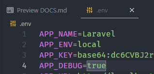
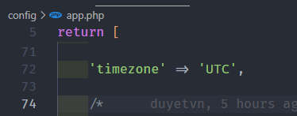

<p align="center"><a href="https://laravel.com" target="_blank"></a></p>

# Get started

## Commands

> `php artisan list make`: all available commands

## Installation

```bash
composer create-project laravel/laravel server-laravel
```

## Configuration

### Get variable from `.env` file



```php
env('APP_DEBUG', false)
> true
```

> false: default value

### Get configuration from `config` folder



```php
config('app.timezone', 'Asia/Seoul')
> UTC
```

> 'Asia/Seoul': default value

### Set configuration value at runtime

```php
config(['app.timezone' => 'America/Chicago']);
```

## Directory Structure

-   `app`:
    -   `Console`: hold `custom` artisan commands
    -   `Riles`: hold custom rules (does not exist by default)
-   `config`: contain all configuration files like `app.timezone`
-   `database`: contain database `migrations`, model `factories`, and `seeds`
-   `public`: houses assets such as: html, css, js, icons
-   `resources`: contain view (V in MVC)...
-   `routes`: container `api.php` to handle `restAPI` or web.php to handle view
-   `storage`: container `logs`, user assets like `image` store in `storage/app/public`

# Architecture Concepts
